# Daily Reflection Tree - Visual Diagram

## Complete Tree Structure

```mermaid
graph TD
    START[START: Good evening greeting] --> A1_OPEN{A1_OPEN: How would you describe today?}
    
    A1_OPEN -->|Productive/Rewarding| A1_D1_HIGH[A1_D1: Decision]
    A1_OPEN -->|Challenging/Frustrating/Overwhelming| A1_D1_LOW[A1_D1: Decision]
    
    A1_D1_HIGH --> A1_Q_AGENCY_HIGH{A1_Q_AGENCY_HIGH: What made it happen?}
    A1_D1_LOW --> A1_Q_AGENCY_LOW{A1_Q_AGENCY_LOW: First instinct?}
    
    A1_Q_AGENCY_HIGH -->|Internal| A1_D2_HIGH_INT[A1_D2_HIGH: Decision]
    A1_Q_AGENCY_HIGH -->|External| A1_D2_HIGH_EXT[A1_D2_HIGH: Decision]
    
    A1_Q_AGENCY_LOW -->|Internal| A1_D2_LOW_INT[A1_D2_LOW: Decision]
    A1_Q_AGENCY_LOW -->|External| A1_D2_LOW_EXT[A1_D2_LOW: Decision]
    
    A1_D2_HIGH_INT --> A1_Q_CHOICE{A1_Q_CHOICE: What guided your decision?}
    A1_D2_HIGH_EXT --> A1_Q_EXTERNAL_ATTR{A1_Q_EXTERNAL_ATTR: Where's your influence?}
    A1_D2_LOW_INT --> A1_Q_CHOICE
    A1_D2_LOW_EXT --> A1_Q_EXTERNAL_ATTR
    
    A1_Q_CHOICE -->|Internal| A1_D3_INT[A1_D3: Decision]
    A1_Q_CHOICE -->|External| A1_D3_EXT[A1_D3: Decision]
    
    A1_Q_EXTERNAL_ATTR -->|Internal| A1_D3_ATTR_INT[A1_D3: Decision]
    A1_Q_EXTERNAL_ATTR -->|External| A1_D3_ATTR_EXT[A1_D3: Decision]
    
    A1_D3_INT --> A1_R_INTERNAL[💭 A1_R_INTERNAL: You see your agency]
    A1_D3_EXT --> A1_R_EXTERNAL[💭 A1_R_EXTERNAL: Choices exist even in constraints]
    A1_D3_ATTR_INT --> A1_R_INTERNAL
    A1_D3_ATTR_EXT --> A1_R_EXTERNAL
    
    A1_R_INTERNAL --> BRIDGE_1_2[→ BRIDGE_1_2: Shift to contribution]
    A1_R_EXTERNAL --> BRIDGE_1_2
    
    BRIDGE_1_2 --> A2_OPEN{A2_OPEN: Interactions today?}
    
    A2_OPEN -->|Contribution| A2_D1_CONTRIB[A2_D1: Decision]
    A2_OPEN -->|Entitlement| A2_D1_ENTITLE[A2_D1: Decision]
    
    A2_D1_CONTRIB --> A2_Q_CONTRIBUTION{A2_Q_CONTRIBUTION: What motivated you?}
    A2_D1_ENTITLE --> A2_Q_ENTITLEMENT{A2_Q_ENTITLEMENT: What did you deserve?}
    
    A2_Q_CONTRIBUTION --> A2_D2_CONTRIB[A2_D2: Decision]
    A2_Q_ENTITLEMENT --> A2_D2_ENTITLE[A2_D2: Decision]
    
    A2_D2_CONTRIB --> A2_Q_DISCRETIONARY{A2_Q_DISCRETIONARY: Anything not required?}
    A2_D2_ENTITLE -->|Earned| A2_Q_DISCRETIONARY
    A2_D2_ENTITLE -->|Owed| A2_Q_COMPARISON{A2_Q_COMPARISON: Compare to others?}
    
    A2_Q_DISCRETIONARY -->|Yes| A2_D3_YES[A2_D3: Decision]
    A2_Q_DISCRETIONARY -->|No| A2_D3_NO[A2_D3: Decision]
    
    A2_Q_COMPARISON -->|Balanced| A2_D3_BAL[A2_D3: Decision]
    A2_Q_COMPARISON -->|Resentful| A2_D3_RES[A2_D3: Decision]
    
    A2_D3_YES --> A2_R_CONTRIBUTION[💭 A2_R_CONTRIBUTION: Organizational citizenship]
    A2_D3_NO --> A2_R_TRANSACTIONAL[💭 A2_R_TRANSACTIONAL: Within the lines]
    A2_D3_BAL --> A2_R_CONTRIBUTION
    A2_D3_RES --> A2_R_ENTITLEMENT[💭 A2_R_ENTITLEMENT: Tracking what you're owed]
    
    A2_R_CONTRIBUTION --> BRIDGE_2_3[→ BRIDGE_2_3: Zoom out to impact]
    A2_R_TRANSACTIONAL --> BRIDGE_2_3
    A2_R_ENTITLEMENT --> BRIDGE_2_3
    
    BRIDGE_2_3 --> A3_OPEN{A3_OPEN: Who comes to mind?}
    
    A3_OPEN -->|Just me| A3_D1_SELF[A3_D1: Decision]
    A3_OPEN -->|Team/Colleague| A3_D1_TEAM[A3_D1: Decision]
    A3_OPEN -->|Customer/Mission| A3_D1_TRANS[A3_D1: Decision]
    
    A3_D1_SELF --> A3_Q_SELF{A3_Q_SELF: What worried you?}
    A3_D1_TEAM --> A3_Q_TEAM{A3_Q_TEAM: Did you take action?}
    A3_D1_TRANS --> A3_Q_TRANSCENDENT{A3_Q_TRANSCENDENT: How does mission change things?}
    
    A3_Q_SELF -->|Self-focused| A3_D2_SELF_S[A3_D2: Decision]
    A3_Q_SELF -->|Others-aware| A3_D2_SELF_O[A3_D2: Decision]
    
    A3_Q_TEAM -->|Yes| A3_D2_TEAM_Y[A3_D2: Decision]
    A3_Q_TEAM -->|No| A3_D2_TEAM_N[A3_D2: Decision]
    
    A3_Q_TRANSCENDENT -->|Meaningful| A3_D2_TRANS_M[A3_D2: Decision]
    A3_Q_TRANSCENDENT -->|Unchanged| A3_D2_TRANS_U[A3_D2: Decision]
    
    A3_D2_SELF_S --> A3_R_SELF_CENTRIC[💭 A3_R_SELF_CENTRIC: Self-referential frame]
    A3_D2_SELF_O --> A3_R_TEAM_AWARE[💭 A3_R_TEAM_AWARE: Perspective-taking]
    A3_D2_TEAM_Y --> A3_R_ALTROCENTRIC[💭 A3_R_ALTROCENTRIC: Self-transcendence]
    A3_D2_TEAM_N --> A3_R_TEAM_AWARE
    A3_D2_TRANS_M --> A3_R_ALTROCENTRIC
    A3_D2_TRANS_U --> A3_R_TEAM_AWARE
    
    A3_R_SELF_CENTRIC --> SUMMARY[📊 SUMMARY: Your reflection]
    A3_R_TEAM_AWARE --> SUMMARY
    A3_R_ALTROCENTRIC --> SUMMARY
    
    SUMMARY --> END[END: See you tomorrow]
    
    style START fill:#e1f5e1
    style END fill:#ffe1e1
    style A1_R_INTERNAL fill:#fff4e1
    style A1_R_EXTERNAL fill:#fff4e1
    style A2_R_CONTRIBUTION fill:#fff4e1
    style A2_R_TRANSACTIONAL fill:#fff4e1
    style A2_R_ENTITLEMENT fill:#fff4e1
    style A3_R_SELF_CENTRIC fill:#fff4e1
    style A3_R_TEAM_AWARE fill:#fff4e1
    style A3_R_ALTROCENTRIC fill:#fff4e1
    style SUMMARY fill:#e1f0ff
    style BRIDGE_1_2 fill:#f0e1ff
    style BRIDGE_2_3 fill:#f0e1ff
```

## Tree Statistics

- **Total Nodes**: 43
- **Question Nodes**: 12 (with fixed options)
- **Decision Nodes**: 8 (internal routing)
- **Reflection Nodes**: 9 (insights/reframes)
- **Bridge Nodes**: 3 (axis transitions)
- **Start/End Nodes**: 2
- **Summary Node**: 1

## Axis Coverage

### Axis 1: Locus (Victim vs Victor)
- **Questions**: 3 (A1_OPEN, A1_Q_AGENCY_HIGH/LOW, A1_Q_CHOICE/EXTERNAL_ATTR)
- **Reflections**: 2 (Internal vs External locus)
- **Psychology**: Rotter's Locus of Control, Dweck's Growth Mindset

### Axis 2: Orientation (Contribution vs Entitlement)
- **Questions**: 4 (A2_OPEN, A2_Q_CONTRIBUTION/ENTITLEMENT, A2_Q_DISCRETIONARY, A2_Q_COMPARISON)
- **Reflections**: 3 (Contribution, Entitlement, Transactional)
- **Psychology**: Psychological Entitlement (Campbell), Organizational Citizenship Behavior (Organ)

### Axis 3: Radius (Self-Centrism vs Altrocentrism)
- **Questions**: 4 (A3_OPEN, A3_Q_SELF, A3_Q_TEAM, A3_Q_TRANSCENDENT)
- **Reflections**: 3 (Self-centric, Team-aware, Altrocentric)
- **Psychology**: Maslow's Self-Transcendence, Batson's Perspective-Taking

## Key Design Features

1. **Deterministic Branching**: Every answer leads to a known next node
2. **State Accumulation**: Signals track axis tendencies (internal/external, contribution/entitlement, etc.)
3. **Text Interpolation**: Reflections reference earlier answers using `{NODE_ID.answer}` placeholders
4. **Progressive Depth**: Each axis builds on insights from the previous one
5. **Non-Judgmental Tone**: Reflections guide awareness without moralizing
6. **18 Summary Templates**: Personalized endings based on the 3×3×3 axis combinations

## Sample Paths

### Path 1: Victor/Contributing/Altrocentric
START → A1_OPEN (Productive) → A1_Q_AGENCY_HIGH → A1_Q_CHOICE → A1_R_INTERNAL → 
BRIDGE_1_2 → A2_OPEN (Helped) → A2_Q_CONTRIBUTION → A2_Q_DISCRETIONARY (Yes) → A2_R_CONTRIBUTION → 
BRIDGE_2_3 → A3_OPEN (Customer) → A3_Q_TRANSCENDENT → A3_R_ALTROCENTRIC → SUMMARY → END

### Path 2: Victim/Entitled/Self-Centric
START → A1_OPEN (Frustrating) → A1_Q_AGENCY_LOW → A1_Q_EXTERNAL_ATTR → A1_R_EXTERNAL → 
BRIDGE_1_2 → A2_OPEN (Expected recognition) → A2_Q_ENTITLEMENT → A2_Q_COMPARISON (Not pulling weight) → A2_R_ENTITLEMENT → 
BRIDGE_2_3 → A3_OPEN (Just me) → A3_Q_SELF → A3_R_SELF_CENTRIC → SUMMARY → END
